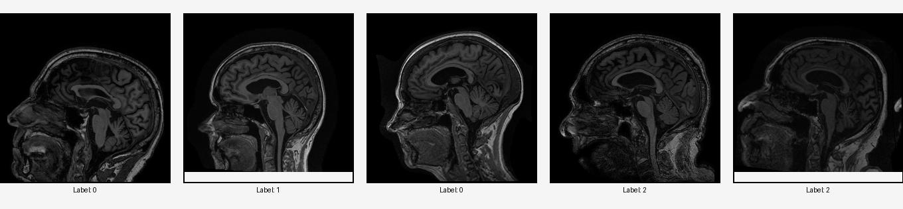

# Alzheimer's Disease Classification using ADNI MRI Dataset

This repository contains a project for classifying MRI scans using a convolutional neural network (CNN). The model classifies MRI slices into three categories: Cognitive Normal (CN ,  Label 0), Alzheimer's Disease (AD, Label 1), and Mild Cognitive Impairment (MCI,  Label 2).




## Project Overview

This project uses the ADNI dataset to train a CNN on middle slices of 3D MRI images. The approach simplifies working with MRI data by focusing on 2D slices, allowing for efficient training and evaluation. The dataset is preprocessed, split into training, validation, and test sets, and used to train a CNN for classification.

---

## Dataset Preparation

### About the ADNI Dataset

The **Alzheimer's Disease Neuroimaging Initiative (ADNI)** dataset is a publicly available dataset designed to support research on the early detection and monitoring of Alzheimer's Disease. The dataset includes a wide variety of imaging modalities, clinical data, and biomarker information.

**Access Information**:

1. Visit the official [ADNI website](http://adni.loni.usc.edu/).
2. Create an account and agree to the data use agreement.
3. Request access to the MRI dataset.

Once approved, download the `.nii` files corresponding to T1-weighted MRI scans. These scans should be organized and labeled for classification.

### Input Data Format

Ensure the dataset folder contains `.nii` files, where each file represents an MRI scan and follows the naming convention:

```
<patient_id>_<class_label>.nii
```

Where `<class_label>` is:

- `CN` for Cognitive Normal
- `AD` for Alzheimer's Disease
- `MCI` for Mild Cognitive Impairment

### Preprocessing Steps

1. **Normalization**: MRI data is scaled to the range `[0, 1]` for consistency.
2. **Middle Slice Extraction**: The central axial slice of each 3D MRI is extracted for analysis.
3. **Scaling**: Extracted slices are converted to grayscale images and rescaled to a range of `[0, 255]`.

### Example Dataset Structure

```
nii_files/
    patient1_CN.nii
    patient2_AD.nii
    patient3_MCI.nii
    ...
```

---

## Code Structure

### `load_mri_data(nii_folder)`

Loads and preprocesses MRI scans, including middle slice extraction and label mapping.

### `MRIDataset` Class

A custom PyTorch Dataset for handling MRI data and applying transformations such as resizing, normalization, and tensor conversion.

### `SimpleCNN` Class

Defines a simple 2D CNN architecture with:

- Two convolutional layers with ReLU activation and max pooling.
- Fully connected layers for classifying images into three categories.

### Training and Evaluation

- Training uses cross-entropy loss and the Adam optimizer.
- The dataset is split into training, validation, and test sets (70%, 15%, 15%).
- Metrics include training/validation loss and accuracy.

---

## Installation

1. Clone the repository:

   ```bash
   git clone https://github.com/aghafoor1208/Alzheimer-s-Disease-Classification-Using-ADNI-MRI-Dataset.git
   ```

2. Install dependencies:

   ```bash
    pip install numpy
    pip install Pillow
    pip install matplotlib
    pip install torch
    pip install torchvision
   ```


## How to Run

1. Place `.nii` files in the `nii_files` folder.
2. Run the main script:
   ```bash
   python AD_classification.py
   ```
3. View training and evaluation results in the terminal.

---

## Results

The model outputs training and validation metrics during each epoch, and final test accuracy is printed after training.

---

## Example Usage

To visualize preprocessing:

```python
plt.figure(figsize=(12, 6))
for i in range(5):
    plt.subplot(1, 5, i + 1)
    plt.imshow(data[i], cmap='gray')
    plt.title(f"Label: {labels[i]}")
    plt.axis('off')
plt.show()
```

---

## Future Work

- Upgrade to 3D CNNs for full-volume MRI analysis.
- Experiment with advanced architectures like ResNet or EfficientNet.
- Incorporate data augmentation for improved generalization.

---


## Contact

For questions or collaborations, please contact:

**Abdul Ghafoor**  
**aghafoor.faculty@aror.edu.pk**  
